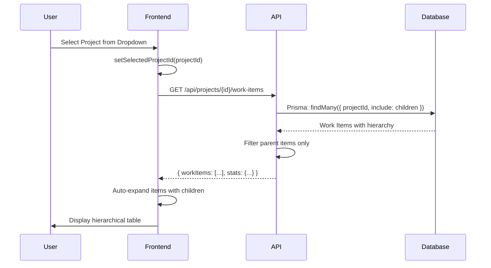
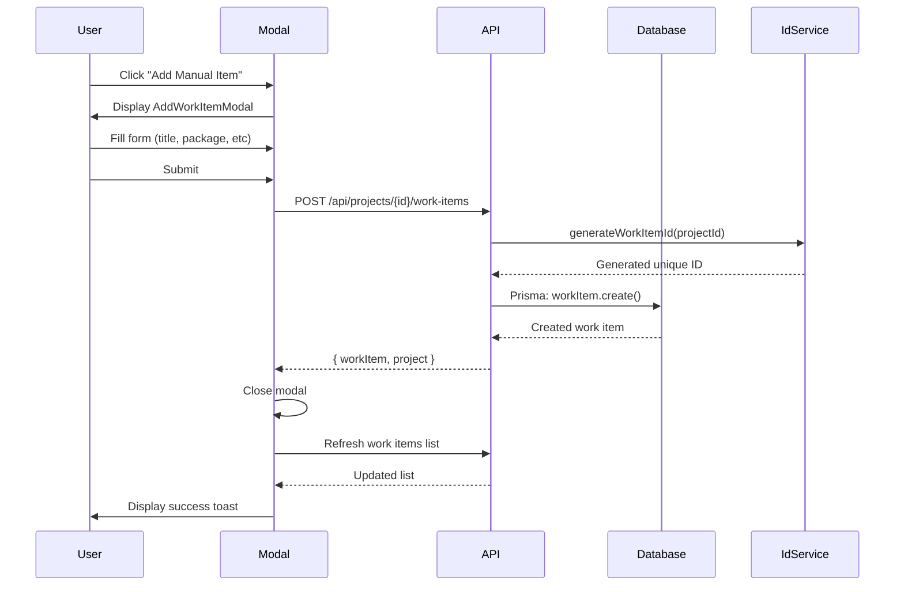
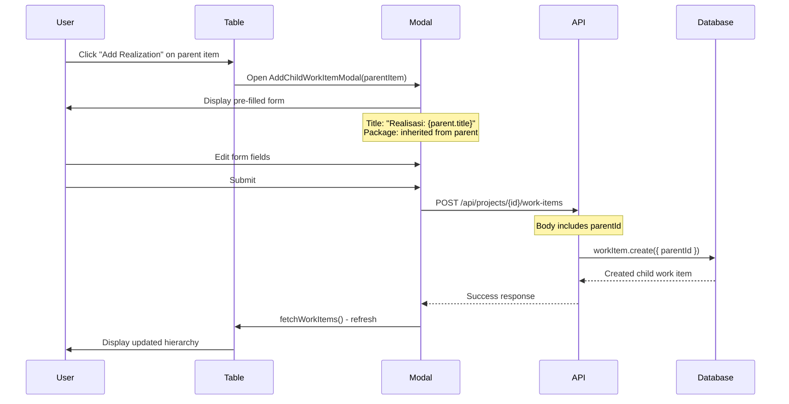
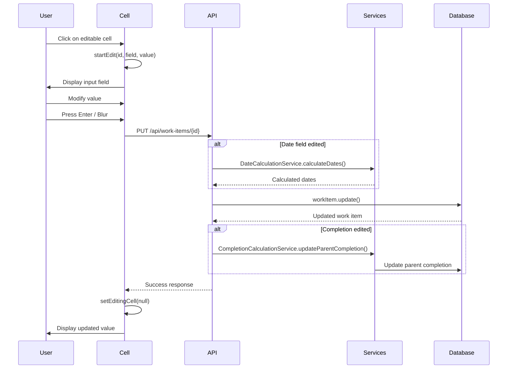
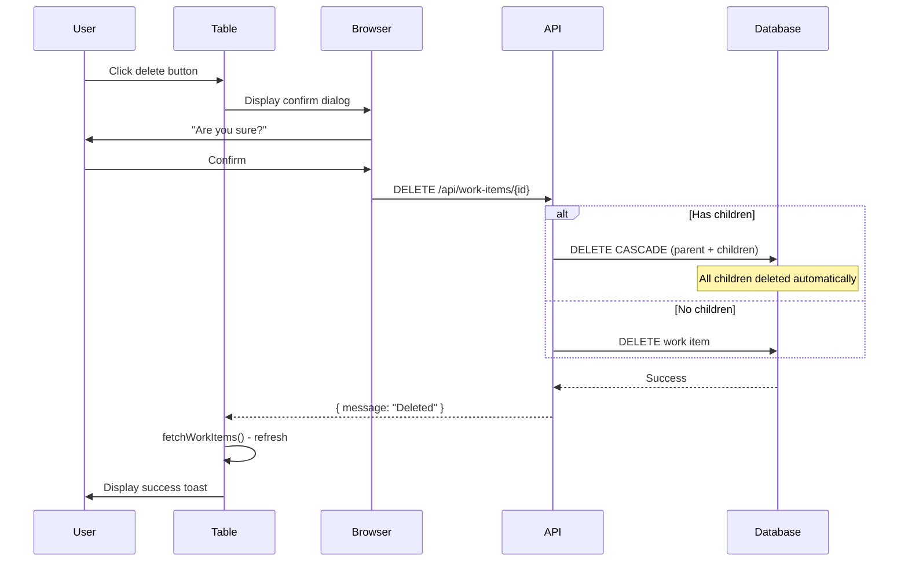
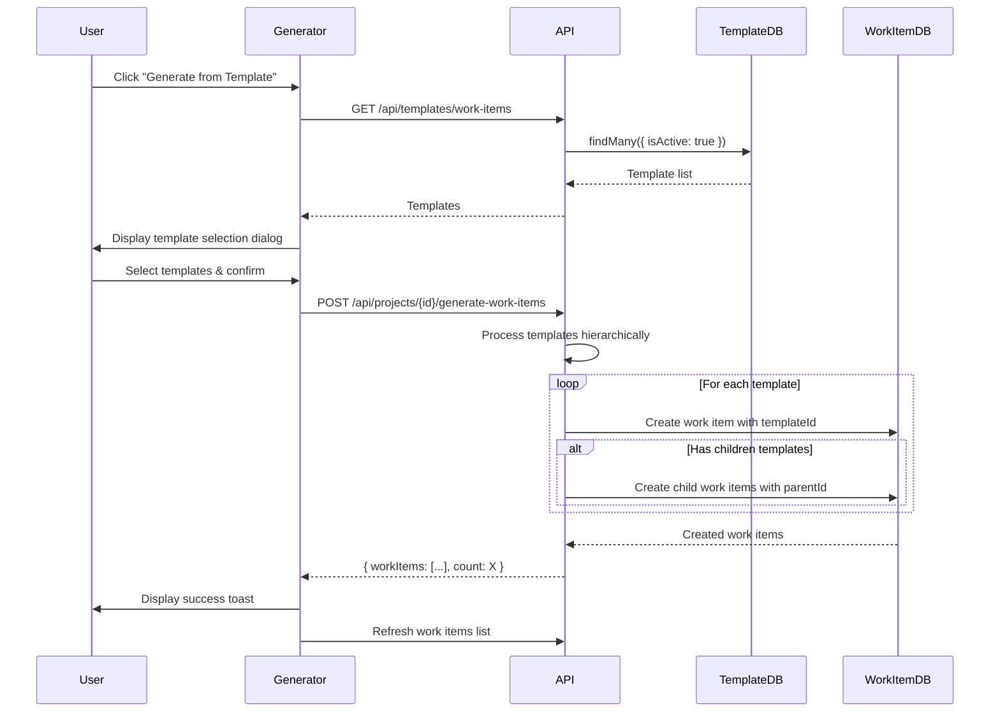
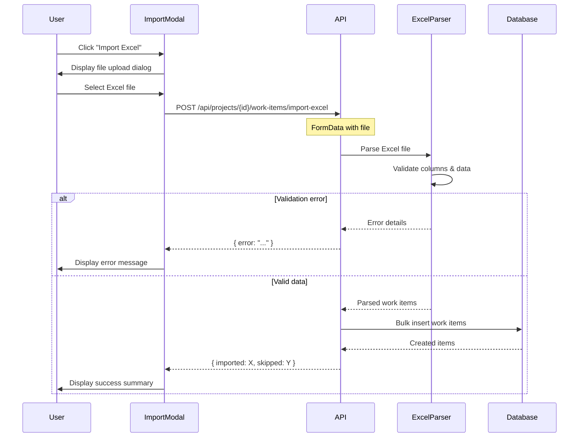
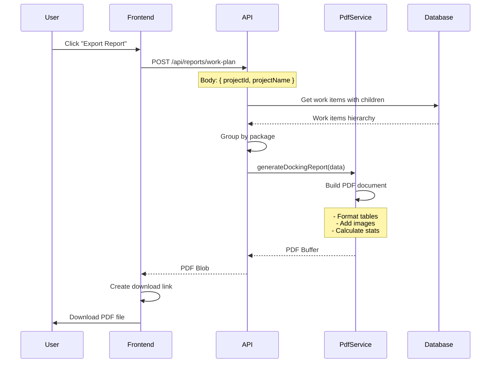
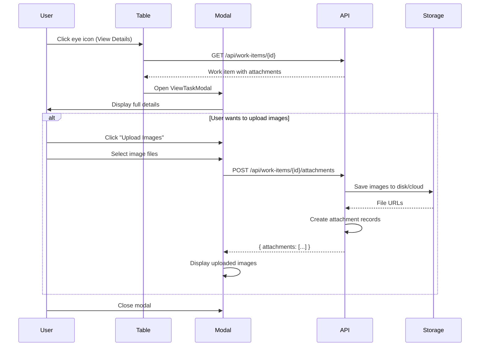
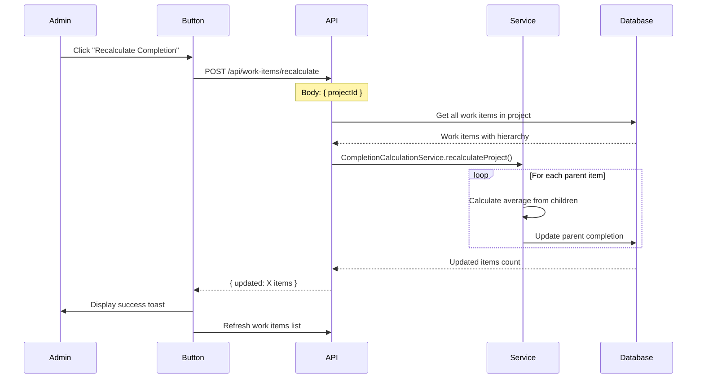

# Work Plan Module - Business Flow Documentation

## 📋 Table of Contents

1. [Overview](#overview)
2. [System Architecture](#system-architecture)
3. [Business Flows](#business-flows)
4. [Data Model](#data-model)
5. [API Endpoints](#api-endpoints)
6. [User Scenarios](#user-scenarios)
7. [Technical Details](#technical-details)

---

## 🎯 Overview

### Purpose
Modul **Work Plan** adalah sistem manajemen work items berbasis hierarki untuk proyek monitoring dan tracking. Sistem ini memungkinkan pengelolaan tasks dalam struktur parent-child dengan fitur auto-calculation dan reporting.

### Key Features
- ✅ Hierarchical work item management (parent-child structure)
- ✅ Multi-project support
- ✅ Inline editing dengan auto-save
- ✅ Auto-calculation (completion percentage, dates, duration)
- ✅ Template-based work item generation
- ✅ Excel import/export functionality
- ✅ PDF report generation
- ✅ Real-time statistics dashboard
- ✅ Package-based organization

---

## 🏗️ System Architecture

### Architecture Layers

```
┌─────────────────────────────────────────────────────────────┐
│                    PRESENTATION LAYER                        │
│  ┌──────────────┐  ┌──────────────┐  ┌──────────────┐      │
│  │   Work Plan  │  │    Modals    │  │  Components  │      │
│  │     Page     │  │  - Add Item  │  │  - Selector  │      │
│  │              │  │  - Add Child │  │  - Table     │      │
│  │              │  │  - View Task │  │  - Generator │      │
│  └──────────────┘  └──────────────┘  └──────────────┘      │
└────────────────────────┬────────────────────────────────────┘
                         │ HTTP/REST API
┌────────────────────────▼────────────────────────────────────┐
│                     API LAYER                                │
│  ┌──────────────────────────────────────────────────────┐   │
│  │  Routes:                                             │   │
│  │  - GET    /api/projects/[id]/work-items             │   │
│  │  - POST   /api/projects/[id]/work-items             │   │
│  │  - PUT    /api/work-items/[id]                      │   │
│  │  - DELETE /api/work-items/[id]                      │   │
│  │  - POST   /api/reports/work-plan                    │   │
│  └──────────────────────────────────────────────────────┘   │
│                                                              │
│  ┌──────────────────────────────────────────────────────┐   │
│  │  Business Logic Services:                           │   │
│  │  - CompletionCalculationService                     │   │
│  │  - DateCalculationService                           │   │
│  │  - IdGeneratorService                               │   │
│  │  - PdfGeneratorService                              │   │
│  └──────────────────────────────────────────────────────┘   │
└────────────────────────┬────────────────────────────────────┘
                         │ Prisma ORM
┌────────────────────────▼────────────────────────────────────┐
│                    DATA LAYER (MySQL)                        │
│  ┌──────────────┐  ┌──────────────┐  ┌──────────────┐      │
│  │   WorkItem   │  │   Project    │  │   Template   │      │
│  │              │  │              │  │              │      │
│  │  - id (PK)   │  │  - id (PK)   │  │  - id (PK)   │      │
│  │  - parentId  │  │  - name      │  │  - package   │      │
│  │  - projectId │  │  - status    │  │  - level     │      │
│  └──────────────┘  └──────────────┘  └──────────────┘      │
└─────────────────────────────────────────────────────────────┘
```

---

## 🔄 Business Flows

### Flow 1: Project Selection & Work Items Loading



**Steps:**
1. User memilih project dari dropdown selector
2. Frontend trigger `fetchWorkItems()` dengan debounce 500ms
3. API query database dengan eager loading (children sampai 3 level)
4. Response hanya return parent items (children sudah embedded)
5. Frontend auto-expand semua items yang memiliki children
6. Render recursive table dengan visual indentation

**Kode Implementation:**
```typescript
// Frontend
const fetchWorkItems = async () => {
  const response = await fetch(
    `/api/projects/${selectedProjectId}/work-items`,
    {
      headers: {
        'Authorization': `Bearer ${token}`,
        'Content-Type': 'application/json'
      }
    }
  )
  
  const data = await response.json()
  setWorkItems(data.workItems)
  
  // Auto-expand items with children
  const itemsWithChildren = new Set<string>()
  data.workItems.forEach(item => {
    if (item.children?.length > 0) {
      itemsWithChildren.add(item.id)
    }
  })
  setExpandedRows(itemsWithChildren)
}
```

---

### Flow 2: Create New Work Item (Manual)



**Steps:**
1. User klik tombol "Add Manual Item"
2. Modal `AddWorkItemModal` terbuka
3. User mengisi form:
   - Title (required)
   - Package (A, B, C)
   - Duration Days
   - Start/Finish Date
   - Resource Names
   - Is Milestone
4. User submit form
5. API generate unique ID menggunakan `idGeneratorService`
6. Database insert new work item
7. Frontend refresh work items list
8. Display success notification

**Validation Rules:**
- Title: minimum 3 characters
- Package: must be A, B, or C
- Duration: minimum 1 day
- Dates: startDate must be before finishDate

---

### Flow 3: Add Child Work Item (Realization)



**Steps:**
1. User klik icon "+" (Add Realization) pada parent work item
2. Modal `AddChildWorkItemModal` terbuka dengan data pre-filled:
   - Title: "Realisasi: [Parent Title]"
   - Package: inherited dari parent
   - Project ID: sama dengan parent
3. User dapat modify fields:
   - Edit title realisasi
   - Set completion percentage
   - Add description
   - Upload images (optional)
4. User submit form
5. API create child work item dengan `parentId` pointing ke parent
6. Database insert dengan foreign key relationship
7. Frontend refresh dan auto-expand parent item
8. Child item tampil dengan indentation visual

**Business Rules:**
- Child item inherit package dari parent
- Child item display label "REALISASI" di kolom package
- Child item tidak bisa memiliki children (max 2 levels)
- Parent completion auto-calculated dari average children completion

---

### Flow 4: Inline Edit Work Item



**Editable Fields:**
- ✏️ Title
- ✏️ Package
- ✏️ Duration Days
- ✏️ Start Date
- ✏️ Finish Date
- ✏️ Completion %
- ✏️ Resource Names
- ✏️ Is Milestone (toggle switch)

**Auto-Calculation Logic:**

**A. Date Calculation:**
```typescript
// If user edit START DATE:
// → Auto calculate FINISH DATE
finishDate = startDate + durationDays

// If user edit FINISH DATE:
// → Auto calculate DURATION DAYS
durationDays = finishDate - startDate

// If user edit DURATION DAYS:
// → Auto calculate FINISH DATE
finishDate = startDate + durationDays
```

**B. Completion Calculation:**
```typescript
// If child completion updated:
// → Auto update parent completion
parentCompletion = average(childrenCompletions)

// Example:
// Child 1: 50%, Child 2: 100%, Child 3: 75%
// → Parent: (50 + 100 + 75) / 3 = 75%
```

**Steps:**
1. User klik cell yang ingin diedit
2. Cell berubah menjadi input field dengan value saat ini
3. User modify value
4. User press Enter atau blur (click outside)
5. Frontend trigger `saveEdit()`
6. API receive update request
7. Jika edit date field → trigger date calculation
8. Jika edit completion → trigger parent completion update
9. Database update work item
10. Frontend refresh cell display

---

### Flow 5: Delete Work Item (with Cascade)



**Steps:**
1. User klik icon trash (delete) pada work item
2. Browser confirm dialog: "Are you sure you want to delete this work item?"
3. User confirm
4. Frontend encode work item ID (handle special characters)
5. API receive delete request
6. Database cascade delete:
   - Jika parent → semua children ikut terhapus
   - Jika child → hanya child yang terhapus
7. Frontend refresh work items list
8. Display success notification

**Cascade Behavior:**
```sql
-- Prisma Schema Definition
parent WorkItem? @relation("WorkItemHierarchy", 
  fields: [parentId], 
  references: [id], 
  onDelete: Cascade
)

-- Database Behavior:
DELETE FROM work_items WHERE id = 'parent-123';
-- Automatically deletes:
--   - work_items WHERE parentId = 'parent-123'
--   - work_item_attachments WHERE workItemId IN (...)
```

---

### Flow 6: Generate Work Items from Template



**Steps:**
1. User klik "Generate from Template"
2. Modal `TemplateGenerator` terbuka
3. Display list available templates dengan checkbox
4. User select templates yang diinginkan
5. User confirm generation
6. API process templates:
   - Create parent work items dari template level 0
   - Create child work items jika template memiliki children
   - Link templateId untuk tracking
   - Set default values (completion: 0%, status: PLANNED)
7. Database insert work items dalam batch
8. Frontend refresh dan display generated items
9. Success toast: "Generated X work items successfully"

**Template Hierarchy Example:**
```
Package A: PELAYANAN UMUM
├── 1. Setibanya di muara
│   ├── a. Realisasi tambat
│   └── b. Realisasi inspeksi
├── 2. Pemeriksaan lambung
│   └── a. Realisasi cleaning
└── 3. Perbaikan minor
```

---

### Flow 7: Excel Import Work Items



**Excel Format Expected:**
| ID | Package | Task Name | Duration | Start | Finish | Complete | Resource | Milestone |
|----|---------|-----------|----------|-------|--------|----------|----------|-----------|
| A-1 | A | Task 1 | 5 | 2025-01-01 | 2025-01-05 | 0 | John | No |
| A-1-a | A | Realisasi A-1 | 3 | 2025-01-02 | 2025-01-04 | 50 | John | No |

**Steps:**
1. User klik "Import Excel"
2. Modal `ExcelImportModal` terbuka
3. User dapat download template Excel kosong
4. User upload filled Excel file
5. API receive file via multipart/form-data
6. `ExcelParser` service validate:
   - Required columns exist
   - Data types correct
   - Date format valid
   - Package values valid (A, B, C)
7. Parser identify parent-child relationship by ID pattern:
   - Parent: `A-1`, `B-2`
   - Child: `A-1-a`, `B-2-b`
8. Database bulk insert dengan transaction
9. Frontend display summary:
   - "Imported: 25 items"
   - "Skipped: 3 items (duplicates)"
10. Auto-refresh work items list

**Validation Rules:**
- Required fields: ID, Title, Package
- Date format: YYYY-MM-DD atau MM/DD/YYYY
- Completion: 0-100
- Package: A, B, atau C
- No duplicate IDs in same project

---

### Flow 8: Export PDF Report



**Report Sections:**
1. **Header:**
   - Project name
   - Vessel name
   - Customer company
   - Report date

2. **Summary Statistics:**
   - Total tasks
   - Average completion
   - Milestones count
   - Package breakdown

3. **Work Items Table (by Package):**
   - ID
   - Task Name
   - Duration
   - Start/Finish dates
   - Completion %
   - Resource Names
   - Realization details (if has children)

4. **Progress Charts:**
   - Completion by package
   - Timeline Gantt chart (optional)

**Steps:**
1. User klik "Export Report"
2. Frontend validate:
   - Project selected
   - Work items exist
3. API receive request dengan project context
4. Query work items dengan eager loading
5. Group work items by package (A, B, C)
6. Process hierarchical data untuk report format
7. `PdfGeneratorService` create PDF:
   - Use reference template format
   - Format tables dengan borders
   - Include images jika ada
8. Stream PDF buffer ke frontend
9. Frontend create download link
10. Auto-download file:
    - Filename: `Docking_Report_{ProjectName}_{Date}.pdf`

---

### Flow 9: View Task Details & Upload Images



**ViewTaskModal Content:**
- 📋 Full title & description
- 📊 Completion percentage dengan progress bar
- 📅 Timeline (start → finish)
- 👥 Resource names
- 📦 Package information
- 🖼️ Image gallery (if attachments exist)
- ⚡ Quick actions:
  - Edit
  - Delete
  - Add realization (if parent)

**Image Upload:**
1. User klik "Upload Images" button
2. File picker open (accept: .jpg, .jpeg, .png, .gif)
3. Multiple files selection allowed
4. Frontend validate:
   - File size < 5MB per file
   - Image format valid
5. Upload via FormData
6. Backend save ke storage (local or cloud)
7. Create `WorkItemAttachment` records
8. Display thumbnails dalam gallery
9. Click thumbnail → open fullscreen preview

---

### Flow 10: Auto-Completion Recalculation



**When to Use:**
- Setelah bulk import
- Setelah manual data fix di database
- Jika completion tidak sync antara parent-child
- Maintenance / data consistency check

**Calculation Logic:**
```typescript
// Get all children completions
const children = await prisma.workItem.findMany({
  where: { parentId: workItemId },
  select: { completion: true }
})

// Calculate average
const totalCompletion = children.reduce(
  (sum, child) => sum + child.completion, 0
)
const averageCompletion = Math.round(
  totalCompletion / children.length
)

// Update parent
await prisma.workItem.update({
  where: { id: workItemId },
  data: { completion: averageCompletion }
})
```

---

## 📊 Data Model

### WorkItem Entity

```typescript
interface WorkItem {
  // Identity
  id: string                    // Primary Key (e.g., "A-1", "B-2-a")
  number?: number               // Sequence number
  
  // Content
  title: string                 // Task name/description
  description?: string          // Detailed description
  category?: string             // Task category
  
  // Hierarchy
  parentId?: string             // Foreign Key to parent WorkItem
  parent?: WorkItem             // Parent reference
  children?: WorkItem[]         // Child work items
  
  // Project Management
  package?: string              // "A", "B", "C"
  durationDays?: number         // Duration in days
  startDate?: string            // Start date (ISO format)
  finishDate?: string           // Finish date (ISO format)
  completion: number            // 0-100
  resourceNames: string         // Comma-separated names
  isMilestone: boolean          // Is this a milestone?
  
  // Relations
  projectId?: string            // Foreign Key to Project
  project?: Project             // Project reference
  templateId?: string           // Foreign Key to Template
  template?: WorkItemTemplate   // Template reference
  
  // Attachments
  attachments?: WorkItemAttachment[]
  
  // Timestamps
  createdAt: Date
  updatedAt: Date
}
```

### Hierarchy Rules

```
LEVEL 0 (Parent):
├── Package: A, B, C
├── Can have children
├── Completion auto-calculated from children
└── Display in white background

LEVEL 1 (Child/Realization):
├── Package label: "REALISASI"
├── Cannot have children (max depth: 2)
├── Completion manually set
├── Display in gray background
└── Indented 30px from parent
```

---

## 🔌 API Endpoints

### GET `/api/projects/[id]/work-items`

**Purpose:** Fetch all work items for specific project with hierarchy

**Request:**
```http
GET /api/projects/abc123/work-items?package=A&status=IN_PROGRESS
Authorization: Bearer {token}
```

**Query Parameters:**
- `package`: Filter by package (A, B, C)
- `status`: Filter by status
- `search`: Search in title/description
- `includeChildren`: Include children in response (default: true)

**Response:**
```json
{
  "project": {
    "id": "abc123",
    "projectName": "MT. FERIMAS SEJAHTERA",
    "vesselName": "MT. FERIMAS SEJAHTERA"
  },
  "workItems": [
    {
      "id": "A-1",
      "title": "Setibanya di muara",
      "package": "A",
      "completion": 50,
      "children": [
        {
          "id": "A-1-a",
          "title": "Realisasi tambat",
          "parentId": "A-1",
          "completion": 100
        }
      ]
    }
  ],
  "stats": {
    "totalWorkItems": 25,
    "averageCompletion": 67,
    "completedWorkItems": 12,
    "inProgressWorkItems": 10,
    "plannedWorkItems": 3
  }
}
```

---

### POST `/api/projects/[id]/work-items`

**Purpose:** Create new work item(s) for project

**Request (Single Item):**
```json
POST /api/projects/abc123/work-items
Authorization: Bearer {token}

{
  "title": "New Task",
  "package": "A",
  "durationDays": 5,
  "startDate": "2025-01-01",
  "completion": 0,
  "resourceNames": "John Doe",
  "isMilestone": false
}
```

**Request (Bulk Create):**
```json
POST /api/projects/abc123/work-items
Authorization: Bearer {token}

{
  "workItems": [
    { "title": "Task 1", "package": "A" },
    { "title": "Task 2", "package": "B" }
  ]
}
```

**Response:**
```json
{
  "message": "Work item created successfully",
  "workItem": {
    "id": "A-25",
    "title": "New Task",
    "projectId": "abc123",
    "completion": 0
  },
  "project": {
    "id": "abc123",
    "projectName": "MT. FERIMAS SEJAHTERA"
  }
}
```

---

### PUT `/api/work-items/[id]`

**Purpose:** Update work item fields

**Request:**
```json
PUT /api/work-items/A-1
Authorization: Bearer {token}

{
  "completion": 75,
  "finishDate": "2025-01-15"
}
```

**Auto-Calculations Triggered:**
- Date change → Auto-calculate duration/dates
- Completion change → Update parent completion

**Response:**
```json
{
  "id": "A-1",
  "title": "Setibanya di muara",
  "completion": 75,
  "finishDate": "2025-01-15",
  "updatedAt": "2025-01-10T08:30:00Z"
}
```

---

### DELETE `/api/work-items/[id]`

**Purpose:** Delete work item (cascade delete children)

**Request:**
```http
DELETE /api/work-items/A-1
Authorization: Bearer {token}
```

**Response:**
```json
{
  "message": "Work item deleted successfully"
}
```

**Note:** Jika work item memiliki children, semua children ikut terhapus (cascade).

---

### POST `/api/reports/work-plan`

**Purpose:** Generate PDF report for project

**Request:**
```json
POST /api/reports/work-plan
Authorization: Bearer {token}

{
  "projectId": "abc123",
  "projectName": "MT. FERIMAS SEJAHTERA",
  "generateForProject": "abc123"
}
```

**Response:**
```
Content-Type: application/pdf
Content-Disposition: attachment; filename="Docking_Report_abc123_2025-01-10.pdf"

[PDF Binary Data]
```

---

## 👤 User Scenarios

### Scenario 1: Project Manager Creates New Project Work Plan

**Actor:** Project Manager

**Goal:** Setup work plan untuk new docking project

**Steps:**
1. Login ke aplikasi
2. Navigate ke "Work Plan & Report" module
3. Klik "Create Project"
4. Isi project details:
   - Project Name: "MT. INDONESIA JAYA - 2025"
   - Vessel Name: "MT. INDONESIA JAYA"
   - Customer: "PT. Pelayaran Nusantara"
5. Save project
6. Klik "Generate from Template"
7. Select template packages:
   - ✅ Package A: PELAYANAN UMUM
   - ✅ Package B: PERAWATAN LAMBUNG & TANGKI
8. Confirm generation
9. System generate 50+ work items dengan hierarchy
10. Review generated work items
11. Edit specific items (dates, resources, duration)
12. Export PDF report untuk review

**Expected Result:**
- Project created successfully
- Work items generated dari template
- Hierarchical structure tampil dengan proper indentation
- PDF report ready untuk client presentation

---

### Scenario 2: Supervisor Updates Daily Progress

**Actor:** Field Supervisor

**Goal:** Update progress harian untuk work items

**Steps:**
1. Login ke aplikasi
2. Select active project
3. Scroll ke work item yang sedang dikerjakan
4. Klik completion cell
5. Update dari 50% → 75%
6. Press Enter
7. System auto-save
8. Parent completion auto-update
9. Upload progress photos:
   - Klik camera icon
   - Select 3 photos
   - Upload completed
10. Add notes di notes column
11. Verify parent item completion updated

**Expected Result:**
- Work item completion updated to 75%
- Parent completion recalculated automatically
- Photos uploaded dan visible di task details
- Notes saved
- Changes reflected real-time

---

### Scenario 3: Admin Imports Work Items dari Excel

**Actor:** Admin

**Goal:** Bulk import work items dari existing Excel planning

**Steps:**
1. Login sebagai admin
2. Select project
3. Klik "Download Template" → get Excel template
4. Fill template dengan data:
   - 100 work items
   - Mix parent dan child items
   - Dates, resources, packages
5. Save Excel file
6. Klik "Import Excel"
7. Upload filled Excel file
8. System validate data
9. Display preview (100 items akan diimport)
10. Confirm import
11. System process:
    - Import: 98 items
    - Skipped: 2 items (duplicate IDs)
12. Review imported items di table
13. Run "Recalculate Completion" untuk sync parent-child

**Expected Result:**
- 98 work items imported successfully
- Hierarchy maintained (parent-child relationship)
- 2 duplicates skipped dengan notification
- All data fields populated correctly
- Parent completions calculated

---

### Scenario 4: Client Views Project Progress Report

**Actor:** Client (Customer Company)

**Goal:** Review current project progress

**Steps:**
1. Project Manager export PDF report
2. Klik "Export Report"
3. System generate comprehensive PDF:
   - Cover page dengan project info
   - Statistics summary
   - Work items table by package
   - Progress photos
   - Timeline chart
4. PDF auto-download
5. Open PDF file
6. Review:
   - Overall completion: 68%
   - Package A: 85% complete
   - Package B: 50% complete
   - Critical items highlighted
7. Client provide feedback via email
8. Project Manager update work items based on feedback
9. Re-export updated report

**Expected Result:**
- Professional PDF report generated
- All data accurate dan up-to-date
- Visual progress representation clear
- Photos included dengan proper captions
- Client satisfied dengan transparency

---

## 🔧 Technical Details

### State Management (Frontend)

```typescript
// Main state variables
const [workItems, setWorkItems] = useState<WorkItem[]>([])
const [selectedProject, setSelectedProject] = useState<Project | null>(null)
const [expandedRows, setExpandedRows] = useState<Set<string>>(new Set())
const [editingCell, setEditingCell] = useState<{id: string, field: string} | null>(null)
const [loading, setLoading] = useState(true)

// Filters
const [searchTerm, setSearchTerm] = useState('')
const [packageFilter, setPackageFilter] = useState('')
const [statusFilter, setStatusFilter] = useState('')
```

### Recursive Rendering Algorithm

```typescript
const renderWorkItem = (item: WorkItem, level: number = 0) => {
  const hasChildren = item.children && item.children.length > 0
  const isExpanded = expandedRows.has(item.id)
  const paddingLeft = level * 30 // Visual indentation
  
  return (
    <Fragment key={item.id}>
      {/* Parent Row */}
      <Tr bg={level > 0 ? 'gray.50' : 'white'}>
        <Td style={{ paddingLeft: `${paddingLeft + 16}px` }}>
          {/* Expand/Collapse Button */}
          {hasChildren && (
            <IconButton
              icon={isExpanded ? <FiChevronDown /> : <FiChevronRight />}
              onClick={() => toggleExpanded(item.id)}
            />
          )}
          <IdDisplay id={item.id} />
        </Td>
        {/* Other columns... */}
      </Tr>
      
      {/* Recursive Children Rendering */}
      {hasChildren && isExpanded && 
        item.children?.map(child => renderWorkItem(child, level + 1))
      }
    </Fragment>
  )
}

// Render only parent items (children akan di-render recursively)
{workItems.filter(item => !item.parentId).map(item => renderWorkItem(item))}
```

### Database Query Optimization

```typescript
// Prisma query dengan eager loading 3 levels deep
const workItems = await prisma.workItem.findMany({
  where: { projectId: id },
  include: {
    children: {
      include: {
        template: true,
        children: {
          include: { template: true }
        }
      }
    },
    parent: { select: { id: true, title: true } },
    template: true
  },
  orderBy: [
    { package: 'asc' },
    { createdAt: 'asc' }
  ]
})

// Return only parent items (children embedded)
return workItems.filter(item => !item.parentId)
```

**Performance Optimization:**
- Single query untuk load full hierarchy
- Composite index: `(projectId, parentId)`
- Index pada `package` untuk filtering
- Eager loading limited to 3 levels (prevent N+1 query)

---

### Error Handling Strategy

```typescript
// API Layer
try {
  const workItem = await prisma.workItem.update({...})
  
  // Auto-calculate parent completion
  if (body.completion !== undefined) {
    await CompletionCalculationService.updateParentCompletion(id)
  }
  
  return NextResponse.json(workItem)
} catch (error) {
  console.error('Error updating work item:', error)
  
  // Return structured error
  return NextResponse.json(
    { 
      error: 'Failed to update work item',
      details: error.message,
      type: error.constructor.name
    },
    { status: 500 }
  )
}
```

**Error Types:**
- **Validation Error (400):** Invalid input data
- **Not Found (404):** Work item atau project tidak exist
- **Conflict (409):** Duplicate ID, circular reference
- **Server Error (500):** Database connection, unexpected error

---

### Security Considerations

**Authentication:**
```typescript
// Setiap API request require Bearer token
headers: {
  'Authorization': `Bearer ${localStorage.getItem('auth_token')}`
}
```

**Authorization:**
- ✅ User hanya bisa access projects yang assigned ke mereka
- ✅ Role-based access: ADMIN, MANAGER, USER
- ✅ ADMIN: full access
- ✅ MANAGER: manage assigned projects
- ✅ USER: view only

**Input Validation:**
- ✅ Sanitize user input untuk prevent XSS
- ✅ Validate file uploads (type, size)
- ✅ Encode/decode IDs dengan special characters
- ✅ Prevent SQL injection via Prisma parameterized queries

---

## 📈 Performance Metrics

### Target Performance:
- **Page Load:** < 2 seconds
- **Work Items Fetch:** < 1 second (untuk 100 items)
- **Inline Edit Save:** < 500ms
- **PDF Generation:** < 5 seconds (untuk 50 items)
- **Excel Import:** < 10 seconds (untuk 100 items)

### Optimization Techniques:
1. **Database:** Indexing, eager loading, query optimization
2. **Frontend:** Memoization, debouncing, lazy loading
3. **API:** Response caching, batch operations
4. **File Upload:** Compression, chunked upload untuk large files

---

## 🎨 UI/UX Design Patterns

### Visual Hierarchy
```
Level 0 (Parent):
├── Background: White (#FFFFFF)
├── Font Size: 14px (md)
├── Font Weight: Medium (500)
├── Indentation: 16px base
└── Package Label: Actual package name

Level 1 (Child):
├── Background: Gray (#F7FAFC)
├── Font Size: 12px (sm)
├── Font Weight: Normal (400)
├── Indentation: 46px (16 + 30)
└── Package Label: "REALISASI"
```

### Color Scheme
- **Primary:** Blue (#3182CE)
- **Success:** Green (#38A169)
- **Warning:** Orange (#DD6B20)
- **Danger:** Red (#E53E3E)
- **Neutral:** Gray (#718096)

### Interactive Elements
- **Hover Effect:** Background opacity change
- **Focus State:** Blue outline
- **Disabled State:** Gray out + cursor not-allowed
- **Loading State:** Spinner animation

---

## 🚀 Future Enhancements

### Planned Features:
1. **Drag & Drop Reordering**
   - Reorder work items via drag & drop
   - Change hierarchy via drag to parent

2. **Gantt Chart View**
   - Visual timeline representation
   - Dependencies visualization
   - Critical path highlighting

3. **Real-time Collaboration**
   - Multiple users editing simultaneously
   - Live updates via WebSocket
   - Conflict resolution

4. **Advanced Filtering**
   - Multiple filter combinations
   - Saved filter presets
   - Smart search dengan AI

5. **Mobile App**
   - Native mobile app (iOS/Android)
   - Offline mode dengan sync
   - Photo upload from camera

6. **Notifications**
   - Email notifications untuk milestones
   - Push notifications untuk updates
   - Slack/Teams integration

---

## 📞 Support & Maintenance

### Common Issues & Solutions:

**Issue 1: Parent completion tidak update otomatis**
- **Solution:** Klik "Recalculate Completion" button
- **Prevention:** Ensure CompletionCalculationService running correctly

**Issue 2: Children tidak muncul setelah add**
- **Solution:** Refresh page atau klik parent collapse/expand
- **Prevention:** Check expandedRows state management

**Issue 3: PDF export gagal**
- **Solution:** Check PDF generator service logs
- **Prevention:** Validate work items data before export

**Issue 4: Excel import skipped many items**
- **Solution:** Validate Excel format sesuai template
- **Prevention:** Use downloaded template as baseline

---

## 📝 Changelog

### Version 2.0 (Current)
- ✅ Hierarchical work items (parent-child)
- ✅ Auto-completion calculation
- ✅ Date auto-calculation
- ✅ Multiple image attachments
- ✅ Excel import/export
- ✅ PDF report generation
- ✅ Template-based generation
- ✅ Real-time statistics

### Version 1.0 (Legacy)
- Basic work items list
- Manual completion tracking
- Single image per work item
- CSV export only

---

## 🔗 Related Documentation

- [API Reference](./API_REFERENCE.md)
- [Database Schema](./DATABASE_SCHEMA.md)
- [User Manual](./USER_MANUAL.md)
- [Developer Guide](./DEVELOPER_GUIDE.md)
- [Deployment Guide](./DEPLOYMENT_GUIDE.md)

---

**Last Updated:** January 2025  
**Version:** 2.0  
**Author:** Development Team  
**Contact:** [email protected]
